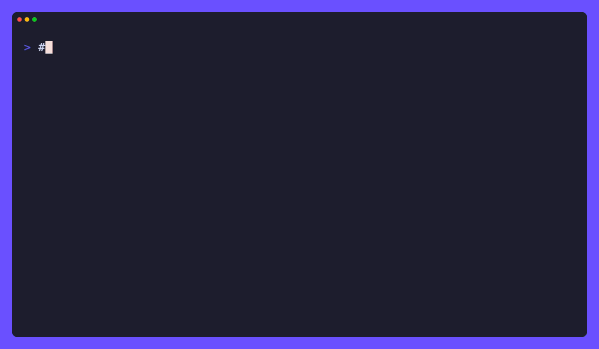

# yomi

[](https://github.com/tamnd/yomi/actions/workflows/ci.yml)
[](https://github.com/tamnd/yomi/releases/latest)
[](https://pkg.go.dev/github.com/tamnd/yomi)
[](https://goreportcard.com/report/github.com/tamnd/yomi)
[](./LICENSE)

**yomi** (読み, "reading") reads a web page, or a whole website, into clean Markdown. It fetches the page, renders the JavaScript in real headless Chrome when the page needs it, throws away the nav and the cookie banner and the share rail, and hands you the article as Markdown with a small front-matter block. One URL gives you one document. A seed URL gives you the whole site, as a folder of files or one combined page.

[Install](#install) • [Quick start](#quick-start) • [Commands](#commands) • [Read a page](#read-a-page) • [Read a whole site](#read-a-whole-site) • [Pack a site into one file](#pack-a-site-into-one-file) • [Images](#images) • [How it works](#how-it-works)



You have done this. You find a good essay, you want to keep it, so you reach for the browser's "Save Page As" and end up with a 4 MB `.html` file and a folder of forty assets that still somehow looks broken. Or you copy-paste into a note and drag along the menu, the newsletter box, the "12 comments" widget, and a cookie banner frozen mid-fade. Or worst of all, the page was built by JavaScript, so "view source" is an empty `<div id="root">` and a prayer.

yomi does the reading for you. It fetches the page the cheap way first, and only spins up a real browser when the page genuinely needs one. Then it finds the part you actually came for, drops everything else, and writes Markdown you can store in a repo, diff in a PR, grep on a train, or feed to whatever comes next. No furniture. No tracking pixels. No surprises six months from now.

Full docs and guides live at **[yomi.tamnd.com](https://yomi.tamnd.com)**.

## Install

```bash
go install github.com/tamnd/yomi/cmd/yomi@latest
```

Prefer a prebuilt binary? Grab an archive, a `.deb`/`.rpm`/`.apk`, or a checksum from [releases](https://github.com/tamnd/yomi/releases). Or let a package manager handle it:

```bash
# Homebrew (macOS)
brew install tamnd/tap/yomi

# Scoop (Windows)
scoop bucket add tamnd https://github.com/tamnd/scoop-bucket
scoop install yomi

# apt (Debian, Ubuntu)
curl -fsSL https://tamnd.github.io/linux-repo/gpg.key | sudo gpg --dearmor -o /usr/share/keyrings/tamnd.gpg
echo "deb [signed-by=/usr/share/keyrings/tamnd.gpg] https://tamnd.github.io/linux-repo/apt stable main" | sudo tee /etc/apt/sources.list.d/tamnd.list
sudo apt update && sudo apt install yomi

# dnf (Fedora, RHEL)
sudo dnf config-manager --add-repo https://tamnd.github.io/linux-repo/dnf/tamnd.repo
sudo dnf install yomi
```

A lot of the web is plain HTML, and for that yomi needs nothing but itself. When a page is JavaScript-built, yomi renders it in headless Chrome, so it needs Chrome or Chromium on the host. It finds a system install on its own; point it somewhere specific with `--chrome` or the `CHROME_BIN` environment variable. Or skip the question entirely and use the container image, which bundles Chromium:

```bash
docker run --rm -v "$PWD/out:/out" ghcr.io/tamnd/yomi read paulgraham.com/greatwork.html -o /out/greatwork.md
```

Shell completion ships in the box: `yomi completion bash|zsh|fish|powershell`.

## Quick start

Let's keep one of Paul Graham's essays as Markdown you can read in your editor:

```bash
# Print it to your terminal
yomi read paulgraham.com/greatwork.html

# Or save it to a file
yomi read paulgraham.com/greatwork.html -o greatwork.md
```

A bare host works fine; yomi fills in `https://` for you. The file opens with a front-matter block carrying what yomi read off the page, then the essay:

```markdown
---
title: "How to Do Great Work"
url: "https://paulgraham.com/greatwork.html"
byline: "Paul Graham"
fetched: "2026-06-18T09:30:00Z"
word_count: 11856
reading_time: 59
---

If you collected lists of techniques for doing great work in a lot of
different fields, what would the intersection look like? ...
```

Want the whole site instead of one page? Point `yomi site` at the host:

```bash
# A folder of Markdown, one file per page, mirroring the URL paths
yomi site paulgraham.com -o pg/

# Read it back in your browser
yomi serve pg/
# open http://127.0.0.1:8800
```

That is the whole loop. The rest of this README is the interesting flags.

## Commands

| Command | What it does |
| --- | --- |
| `yomi read <url \| file \| ->` | Read one page (URL, local file, or stdin) to stdout, or to a file with `-o`. |
| `yomi site <url>` | Crawl a site into a folder, one combined file with `--single`, or a JSON/JSONL dataset. |
| `yomi pack <url>` | Crawl a site into one file: a SQLite database, ZIM archive, or EPUB book, resumable. |
| `yomi meta <url>` | Print a page's metadata as JSON, without the body. |
| `yomi links <url>` | List the real links in a page's article body. |
| `yomi serve [dir]` | Preview a folder of Markdown in your browser. |

Run `yomi <command> --help` for the full flag list.

## Read a page

`yomi read` is the core: one URL in, clean Markdown out, to stdout by default so it pipes and redirects like any Unix tool.

```bash
# Pull just the front-matter off the top
yomi read paulgraham.com/greatwork.html | head -n 7

# Skip the front-matter, keep the title as a heading, wrap at 80 columns
yomi read example.com --no-front-matter --title-heading --wrap 80

# Force a render for a single-page app, scrolling to trip lazy-loaded content
yomi read example.com --render on --scroll

# Read a local file or stdin instead of fetching, and emit JSON
yomi read saved-page.html -f json
curl -s example.com | yomi read - --base https://example.com -f json
```

The source can be a URL, a local `.html` file, or `-` for HTML on standard input, so you can convert a page you already have without a fetch; pass `--base` so relative links resolve. `-f/--format` chooses the output shape: `md` (the default), `json` or `jsonl` for the full page record with the Markdown body, or `html` for a self-contained article.

The default `--render auto` is the part worth understanding. yomi fetches the page with a plain HTTP request first. Then it looks at what came back, and only escalates to headless Chrome when the page looks JavaScript-gated: an empty SPA mount like `#root`, `#__next`, or `#app`, a `<noscript>` that says JavaScript is required, or under 25 words of visible text. A page that already arrived as readable HTML never launches a browser, so the common case stays fast. Force the choice with `--render on` (always render) or `--render off` (never launch a browser).

### Just the metadata, or just the links

Two smaller commands read the same page and report on it instead of converting it. `yomi meta` prints the metadata record as JSON, handy for scripting a list of URLs:

```bash
yomi meta paulgraham.com/greatwork.html | jq '{title, word_count, reading_time}'
```

`yomi links` prints the outbound links from the article body, one per line. Because they come from the extracted content and not the whole page, you get the links the author actually wrote, not the nav and footer around them:

```bash
yomi links paulgraham.com/greatwork.html        # one URL per line
yomi links paulgraham.com/greatwork.html --json # structured, with link text
```

The shared read flags (`--render`, `--scroll`, `--timeout`, `--images`, and the rest) apply to all four reading commands, since each has to fetch and extract a page before it can do its job.

## Read a whole site

`yomi site` crawls breadth-first from a seed URL, reads every in-scope page, and writes the result as a folder (the default) or one combined file (`--single`). A crawl is polite by default: it honours `robots.txt`, stays on the seed host, and reads four pages at a time.

```bash
# The whole site, into a folder named after the host
yomi site paulgraham.com -o pg/

# Just one section, two hundred pages at most, ignoring two subtrees
yomi site go.dev --scope-prefix /doc --max-pages 200 --exclude /blog --exclude /play

# Pull in subdomains, and collapse everything into one file
yomi site example.com --subdomains --single -o example.md
```

A folder crawl mirrors the URL paths and rewires internal links to point at the other Markdown files, so the result navigates offline:

```
pg/
├── SUMMARY.md            # table of contents, one row per page
├── index.md              # the home page (/)
├── greatwork.md          # /greatwork.html
├── articles.md           # /articles.html
└── media/                # downloaded images, shared across pages
```

`--single` collapses the same crawl into one document: a table of contents at the top, then each page as its own anchored section, with every page's headings demoted a level so the file keeps one clean outline. Reach for the folder when you want each page as its own editable file; reach for `--single` when you want the whole site as one thing to read top to bottom or hand to a tool. For the crawl as data, `--format json` or `--format jsonl` writes one structured file of every page instead.

A Markdown crawl is resumable: it records each page in a `.yomi-state.jsonl` sidecar as it goes, so `--resume` continues an interrupted run rather than starting over. `--sitemap` seeds the crawl from the site's `sitemap.xml` so it reaches pages that are listed but not linked.

The flags you will actually reach for:

| Flag | Default | Meaning |
|------|---------|---------|
| `-f, --format` | `md` | Output format: `md` (folder or `--single`), `json`, or `jsonl` |
| `-o, --out` | the host | Output folder, or file path with `--single`/`--format` |
| `-s, --single` | `false` | One combined file instead of a folder |
| `--resume` | `false` | Continue an interrupted Markdown crawl from its sidecar |
| `--sitemap` | `false` | Seed the crawl from the site's sitemap |
| `-p, --max-pages` | `0` | Stop after N pages (0 = no limit) |
| `-d, --max-depth` | `0` | How many links deep to follow (0 = no limit) |
| `--scope-prefix` | | Only crawl paths starting with this prefix |
| `--subdomains` | `false` | Treat subdomains of the seed host as in scope |
| `--exclude` | | Path prefixes to skip (repeatable) |
| `--workers` | `4` | How many pages to read at once |
| `--no-robots` | `false` | Ignore `robots.txt` (be nice) |

## Pack a site into one file

`yomi site` gives you a folder of files. `yomi pack` gives you one file: a crawl of the whole site bundled into a single SQLite database, a single ZIM archive you can open in [Kiwix](https://kiwix.org), or a single EPUB book you can read on any e-reader. The crawl is backed by the database every way, so a pack resumes where it left off and a later run only fetches what changed.

```bash
# A SQLite database of the whole site (the default format)
yomi pack paulgraham.com -o pg.db

# A ZIM offline archive, browsable in Kiwix
yomi pack paulgraham.com -o pg.zim

# An EPUB book for an e-reader
yomi pack paulgraham.com -o pg.epub
```

The output extension picks the format, so `-o pg.zim` builds a ZIM, `-o pg.epub` builds an EPUB, and `-o pg.db` builds a database without you also passing `--format`. With no `-o`, pack writes `<host>.db` (or `<host>.zim`/`<host>.epub`).

**SQLite** is the format to reach for when you want to query the site. Every page is a row in a clean `pages` table, with its title, byline, language, word count, reading time, and the Markdown body, alongside `links` and `images` tables that join back to it:

```bash
yomi pack paulgraham.com -o pg.db
sqlite3 pg.db "select title, word_count, reading_time from pages order by word_count desc limit 5;"
```

**ZIM** is the format to reach for when you want to read the site offline. pack renders each page to a self-contained HTML document, rewires the in-scope links to point at the sibling entries, generates a contents page as the landing page, and writes one OpenZIM file. Open it in Kiwix on any device, or serve it with `kiwix-serve`. A ZIM build keeps its SQLite store next to the archive as a sidecar, so the next run is incremental too.

**EPUB** is the format to reach for when you want the site as a book. pack renders each page to a well-formed XHTML chapter, rewires the in-scope links to the sibling chapters, generates a navigation table of contents, and puts a drawn-in-code cover in front. The book opens in Apple Books, a Kobo, or any reading app, and like a ZIM build it keeps its SQLite store as a sidecar for the next run. Pass `--icon` to use your own cover.

The crawl resumes by default. Run pack again and it keeps every page already stored, fetching only pages it has not seen:

```bash
yomi pack paulgraham.com -o pg.db   # first run: reads the whole site
yomi pack paulgraham.com -o pg.db   # again: new 0, every page kept
```

Two flags drive a refresh. `--refresh` re-fetches every page, ignoring what is stored. `--max-age` re-fetches only the pages older than a cutoff, so a daily mirror stays current without reading the whole site each time:

```bash
yomi pack paulgraham.com -o pg.db --refresh        # re-read everything
yomi pack paulgraham.com -o pg.db --max-age 24h    # re-read pages older than a day
```

pack takes the same scope, limit, worker, and robots flags as `yomi site` (`--scope-prefix`, `--max-pages`, `--max-depth`, `--subdomains`, `--exclude`, `--workers`, `--no-robots`), plus `--sitemap` to seed the crawl from the site's sitemap and metadata flags for the ZIM and EPUB formats (`--title`, `--language`, `--date`, `--icon`, plus ZIM-only `--description` and `--no-compress`).

## Images

By default yomi leaves images as the remote URLs the page used, so the Markdown stays tiny. Two other policies make the output self-contained:

```bash
# Download each image next to the output and rewrite to a relative path
yomi read example.com -o page.md --images download

# Embed each image inline as a base64 data URI, one self-contained file
yomi read example.com -o page.md --images inline
```

For a single read, `download` writes images into a `<name>.media/` sidecar folder next to the file. For a site crawl, every page shares one `media/` folder at the root, so an image used on ten pages is stored once. Both fetch image bytes, so yomi skips anything over `--max-image-mb` (16 by default) and leaves it at its remote URL rather than bloating the output.

## How it works

A read is four steps, in order:

```
url ─▶ fetch (HTTP) ─▶ render only if needed (headless Chrome) ─▶ extract the article ─▶ convert to Markdown
```

The static fetch handles most pages on its own. The render step is the escape hatch for JavaScript-built pages, and `auto` mode keeps it from firing unless the static HTML really came back empty. Extraction runs readability over whatever HTML survived, keeping the main content and dropping the chrome. Conversion turns that into GitHub-Flavored Markdown, and a fair amount of yomi's code is the careful bit here: keeping code-block languages, turning tables back into tables, dropping permalink pilcrows and duplicate captions, and restoring punctuation a naive converter would mangle.

A site crawl wraps the same read in a breadth-first frontier, shares one browser pool across the workers, and assembles the pages into a folder or a single file once the crawl settles.

It is a sibling to [kage](https://github.com/tamnd/kage), which mirrors a site as a browsable offline HTML copy and keeps its *shape*. yomi keeps the *reading*. They share the same headless-browser engine, the same scope model, and the same robots handling, so a yomi crawl and a kage clone agree on what is in scope. kage is "let me browse this offline"; yomi is "let me read this in my editor".

## Building from source

```bash
git clone https://github.com/tamnd/yomi
cd yomi
make build   # -> bin/yomi
make test    # the full suite
```

The repo is split by concern:

```
cmd/yomi/   thin main: builds the signal-aware context, hands off to cli.Execute
cli/        the cobra command tree and flag wiring (cobra + fang)
fetch/      static fetch, the JavaScript-gated heuristic, and the render escalation
extract/    readability extraction, metadata harvest, and code-block language recovery
mdconv/     HTML-to-Markdown conversion and the Markdown-quality passes
site/       the breadth-first crawl frontier
yomi/       the public API: Read, ReadAll, Site, and the folder/single assemblers
docs/       the tago documentation site
```

## Releasing

Push a version tag and GitHub Actions runs GoReleaser, which builds the archives, the `.deb`/`.rpm`/`.apk` packages, a multi-arch GHCR image with Chromium bundled, checksums, SBOMs, and a cosign signature:

```bash
git tag v0.1.2
git push --tags
```

The image tag carries no `v` prefix (`ghcr.io/tamnd/yomi:0.1.2`). The Homebrew and Scoop steps self-disable until their tokens exist, so the first release works with no extra secrets.

## License

MIT. See [LICENSE](LICENSE).
